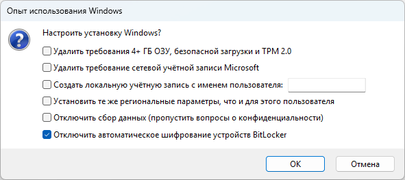
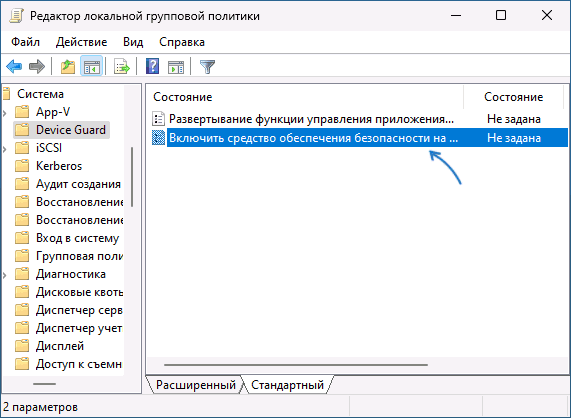
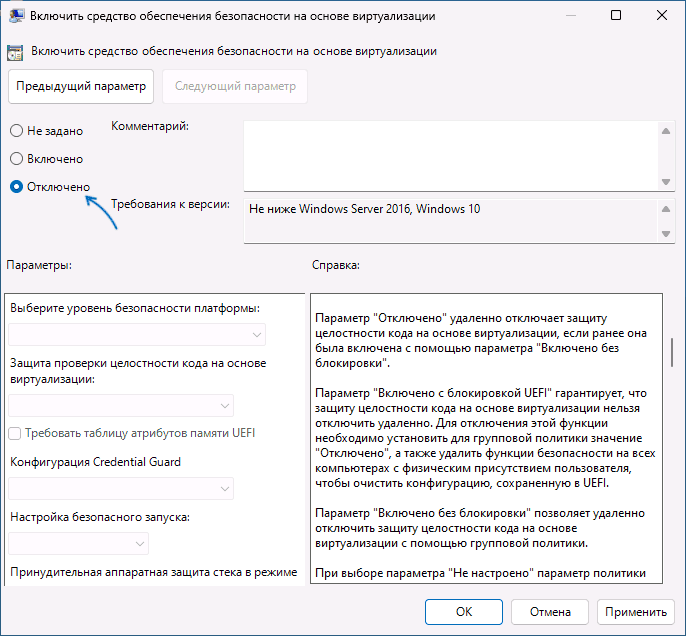
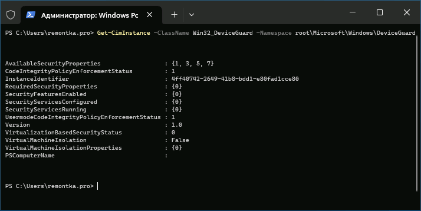
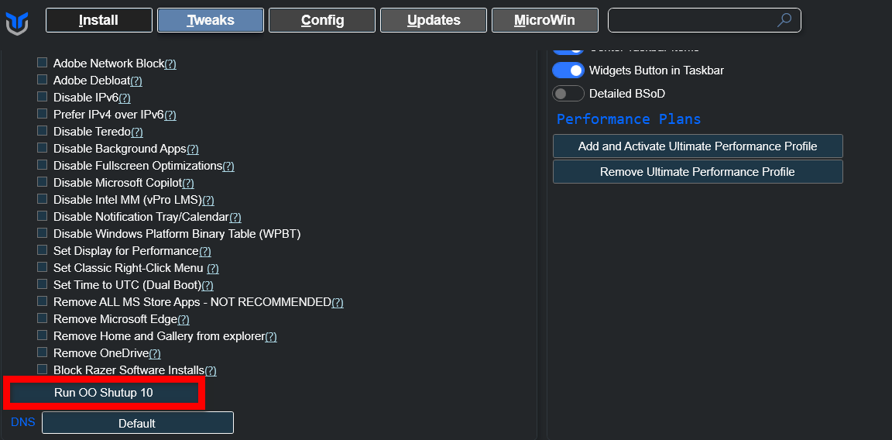
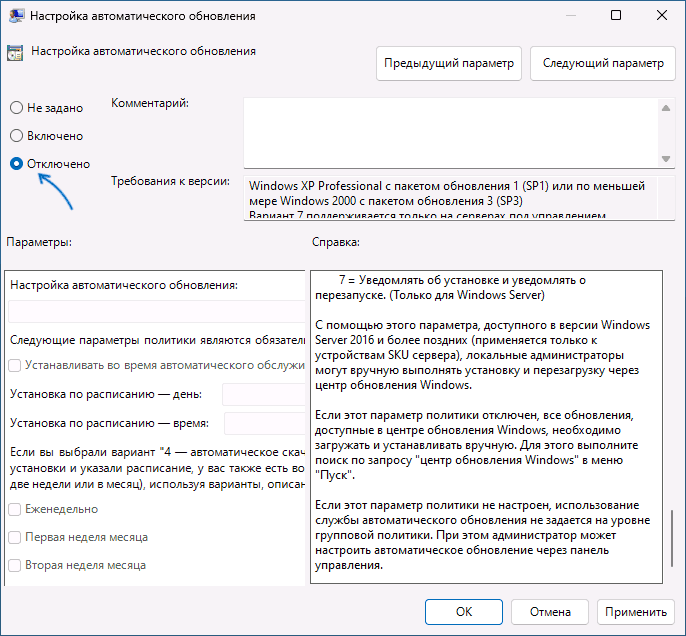
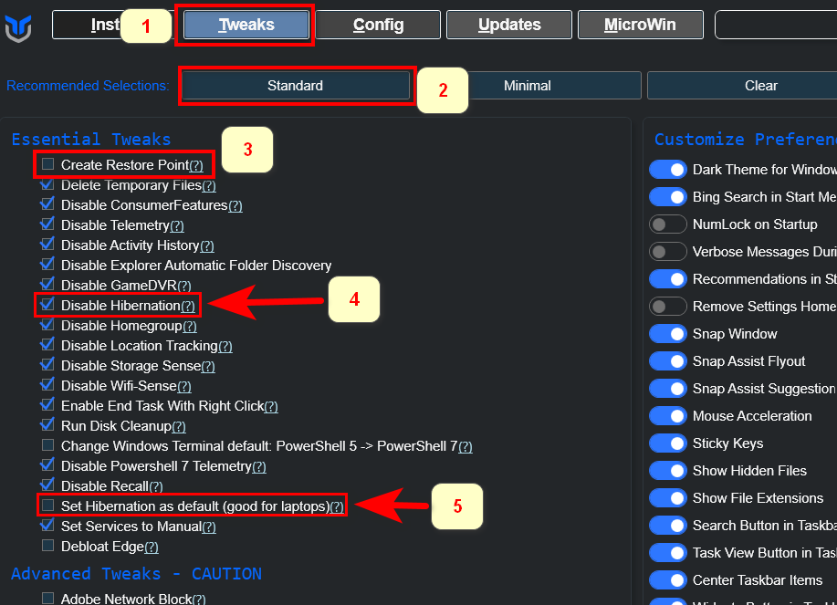

## 📖 Предисловие 
1. **Сначала прочтите полностью инструкцию.**
2. **Не рекомендую сжимать Windows с помощью CompactOS** — это может слегка замедлить работу некоторых приложений.
3. **Отключать или нет зарезервированное хранилище?** Оно обеспечивает наличие свободного пространства при обновлениях, так как недостаток места на «Диске C» — одна из наиболее частых причин ошибок при этих процессах. Решайте сами.


## 🛠️ Установка
1. **Качаем образ с оф. сайта Microsoft.**
2. **Записываем образ на флешку через Rufus**, предварительно поставив галочку в отключении шифрования:  
   
3. **Устанавливаем Windows PRO** (иначе не будет редактора политик).  
   <u>К интернету не подключаемся!</u>
4. **Настраиваем имя ПК, жесткие диски, переносим папки на другие диски.**
5. **Перезагрузка.**
6. **Включаем интернет, ставим обновления и обновляем приложения в MS Store** во вкладке «Скачивание».
7. **Перезагрузка.**
8. **Еще раз проверяем обновления и перезагружаем.**
9. **Устанавливаем драйвера:**
   - **Чипсет:**
     - Для ноутбуков — на официальном сайте производителя.
     - Для ПК — на официальном сайте материнской платы.
   - **Видеокарта:**
     - Для Nvidia — через Nvidia App.
     - Для AMD — через сканер драйверов AMD.
   - **Остальное (звук, принтер и т.д.).**
10. ❗Обязательно❗ **вырубаем оверлеи** от Nvidia/Amd в настройках, ибо они жрут ресурсы и могут быть статтеры (по крайней мере у меня на AMD)
11. **Перезагрузка.**


## ⚙️ Настройка
1. **Отключаем изоляцию ядра:**
   - Нажмите клавиши **Win+R** на клавиатуре, введите **gpedit.msc** и нажмите Enter.
   - Перейдите в раздел:  
     **Конфигурация компьютера → Административные шаблоны → Система → Device Guard.**
   - Дважды нажмите по политике «Включить средство обеспечения безопасности на основе виртуализации»:  
     
   - Установите значение **«Отключено»**:  
     
   - <u>Перезагрузка</u>
   - **Проверка статуса изоляции ядра** — в терминале:  
     `SecurityServicesRunning` и `VirtualisationBasedSecurityStatus` должны быть равны 0:  
     
     ```
     Get-CimInstance -ClassName Win32_DeviceGuard –Namespace root\Microsoft\Windows\DeviceGuard
     ```
     
2. **Настраиваем обновления:**
   - Идем в групповые политики в раздел Конфигурация компьютера — Административные шаблоны — Компоненты Windows — Центр обновления Windows — Управление       интерфейсом пользователя. Дважды нажмите по параметру «Настройка автоматического обновления»:
   - 
   - Переключите политику в состояние «Отключено» и примените настройки:
   - 
   
3. **Ставим [vcredist](https://github.com/abbodi1406/vcredist).**
4. **Удаляем мусор с помощью [Win11Debloat](https://github.com/Raphire/Win11Debloat).**
5. **Оптимизация и установка ПО с помощью [ChrisTitusTech/winutil](https://github.com/ChrisTitusTech/winutil):**
   **Идем во вкладку TWEAKS, нажимаем на STANDART и снимаем галочки с пункта 3, И ⚠️ВНИМАНИЕ⚠️:**
   - **Если у вас ноутбук, то снимаем галочку в пункте 4 и ставим галочку в пункте 5.**
   - **Если у вас ПК, то наоборот — в пункте 4 ставим галочку, в пункте 5 убираем.**  
         
6. **Удаляем Edge с помощью [Remove-MS-Edge](https://github.com/ShadowWhisperer/Remove-MS-Edge), скачав `Remove-Edge.exe - Removes Edge only, leaves WebView alone`.**  
    <u>Удаляем только Edge</u>, WebView не трогаем, он нужен для программ.
7. **Отключаем заплатки** Meltdown and Spectre: [InSpectre](https://www.grc.com/inspectre.htm)
8. **Перезагрузка.**


## 💾 Если места слишком мало
**Внимание:** В Windows 11 LTSC эти параметры уже выключены из коробки.
Перед включением интернета и обновлением в командной строке от администратора ввести:
1. `DISM /Online /Set-ReservedStorageState /State:Disabled`
2. `compact /compactos:always`  
   


## 🕰️ Если система слишком старая:
[4PDA](https://4pda.to/forum/index.php?showtopic=1053118)


## 🔗 Полезности
- **Отключение обновлений:** https://remontka.pro/disable-updates-windows-11/
- **Отключение изоляции ядра:** https://remontka.pro/disable-core-isolation-windows/
- ⚠️Не рекомендую⚠️**Скрипт на удаление Защитника Windows + Отключение заплаток Mitigations** (опционально, для старых процессоров обязательно, так как может увеличить производительность вплоть до 20-30%). Также удаляет раздел с UAC: https://github.com/ionuttbara/windows-defender-remover
- **Сжатие системы:** https://remontka.pro/compact-os-windows-10/
- **Зарезервированное хранилище:** https://remontka.pro/disable-reserved-storage-windows/

